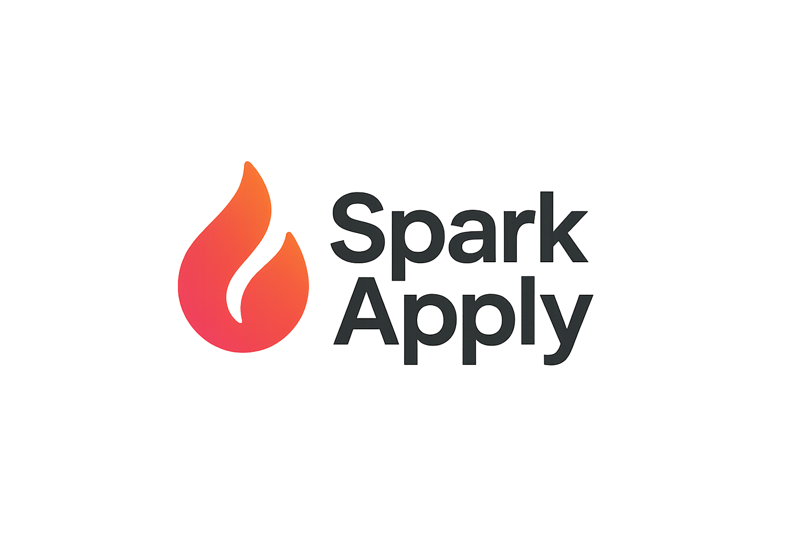
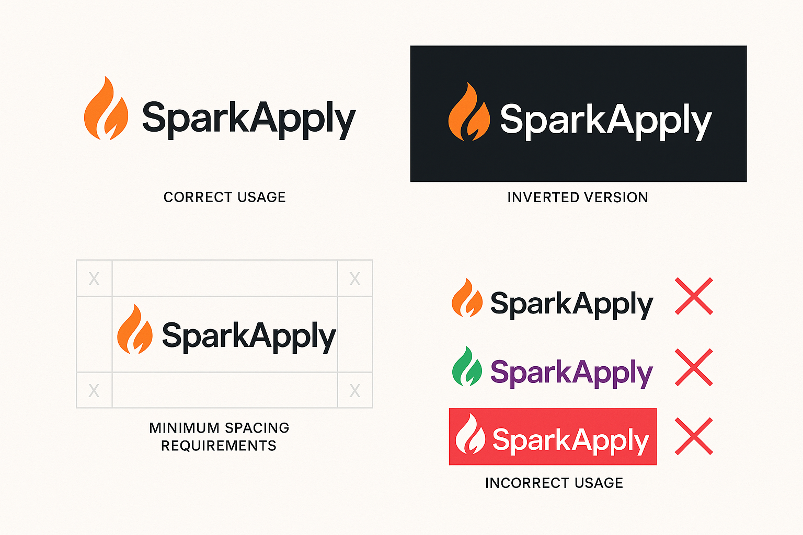
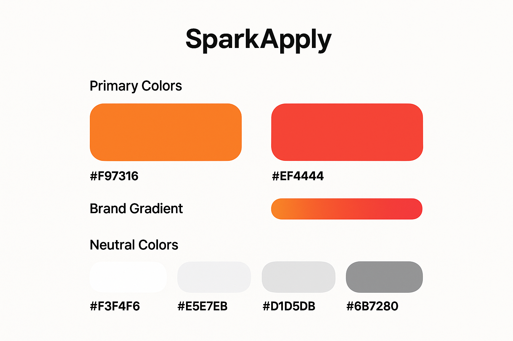
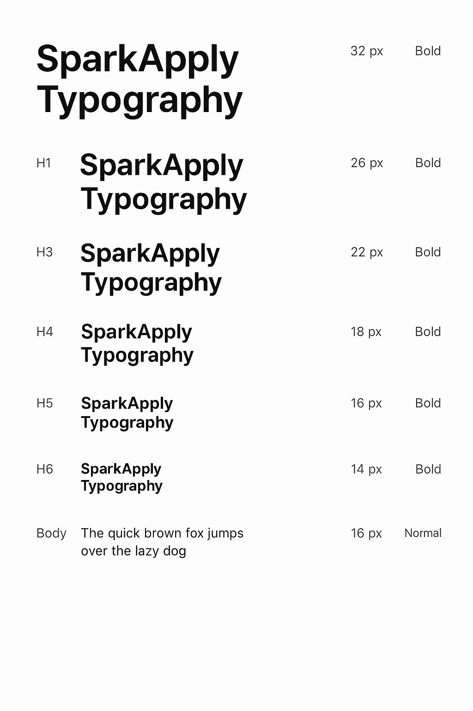
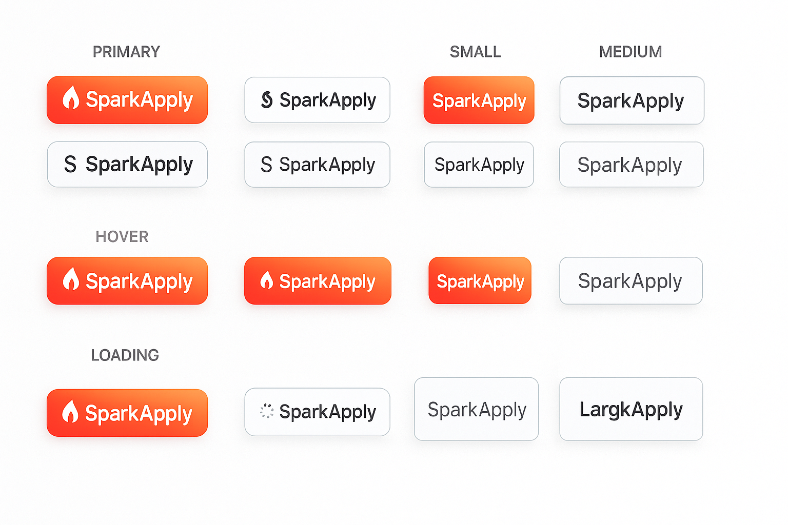
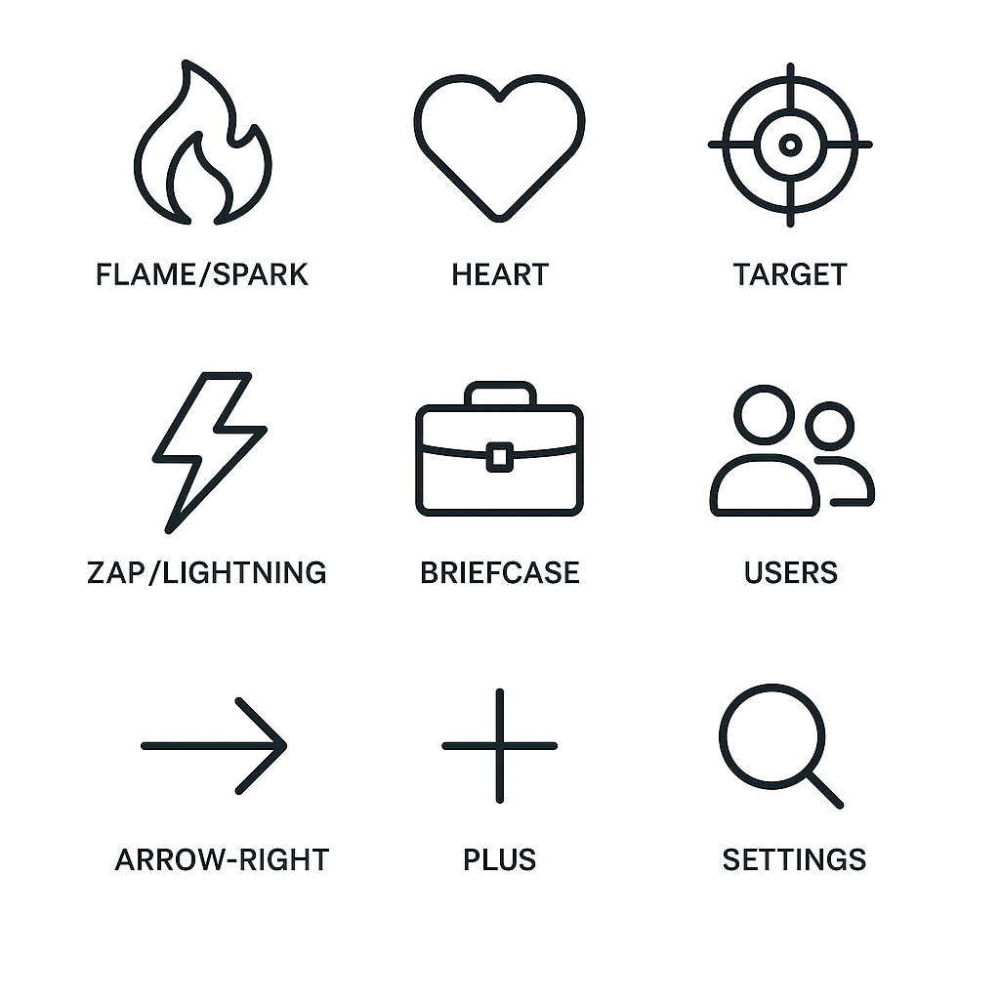

# SparkApply Brand Style Guide

*Version 1.0 | October 2025*

---

## 🎯 Brand Overview

SparkApply is an AI-powered job application platform that revolutionizes the job search experience through swipe-based discovery, automated applications, and intelligent matching. Our brand embodies innovation, energy, and the spark of opportunity that ignites career transformations.

### Brand Personality
- **Innovative**: Cutting-edge AI technology
- **Energetic**: Dynamic and engaging experience  
- **Empowering**: Helps users take control of their career
- **Approachable**: User-friendly and accessible
- **Professional**: Trustworthy and reliable

---

## 🔥 Logo & Brand Mark

### Primary Logo


The SparkApply logo features a distinctive flame icon paired with modern typography. The flame symbolizes the "spark" of opportunity and the energy of career transformation.



### Logo Usage Guidelines

#### ✅ **Do's**
- Use the logo on light backgrounds with original colors
- Maintain minimum clear space of 1x the flame height around the logo
- Use the inverted (white) version on dark backgrounds
- Scale proportionally - never stretch or distort
- Use high-resolution versions for print materials

#### ❌ **Don'ts**
- Don't change the logo colors
- Don't separate the flame from the text
- Don't add effects, shadows, or outlines
- Don't place on busy or low-contrast backgrounds
- Don't rotate or skew the logo

### Logo Variations

| Variation | Usage | Background |
|-----------|-------|------------|
| **Full Color** | Primary usage | Light backgrounds, white |
| **White/Inverted** | Dark backgrounds | Dark gray (#1F2937), black |
| **Monochrome** | Single-color applications | Any high-contrast background |

### Minimum Sizes
- **Digital**: 120px width minimum
- **Print**: 1 inch width minimum
- **Favicon**: 32x32px (simplified flame only)

---

## 🌈 Color Palette



### Primary Colors

#### Brand Orange
- **Primary**: `#F97316` (Orange-500)
- **Hover**: `#EA580C` (Orange-600)
- **Light**: `#FED7AA` (Orange-200)
- **Background**: `#FFF7ED` (Orange-50)

#### Brand Red
- **Primary**: `#EF4444` (Red-500)
- **Hover**: `#DC2626` (Red-600)
- **Light**: `#FECACA` (Red-200)
- **Background**: `#FEF2F2` (Red-50)

#### Brand Gradient
```css
background: linear-gradient(to right, #F97316, #EF4444);
```

### Secondary Colors

#### Neutral Grays
- **Text Primary**: `#111827` (Gray-900)
- **Text Secondary**: `#6B7280` (Gray-500)
- **Text Muted**: `#9CA3AF` (Gray-400)
- **Border**: `#E5E7EB` (Gray-200)
- **Background**: `#F9FAFB` (Gray-50)

#### Accent Colors
- **Success**: `#10B981` (Emerald-500)
- **Warning**: `#F59E0B` (Amber-500)
- **Error**: `#EF4444` (Red-500)
- **Info**: `#3B82F6` (Blue-500)

### Color Usage Guidelines

| Element | Color | Usage |
|---------|-------|-------|
| **Primary CTAs** | Orange-Red Gradient | Main action buttons |
| **Secondary CTAs** | Orange-500 | Secondary actions |
| **Links** | Orange-500 | Text links, navigation |
| **Success States** | Emerald-500 | Confirmations, completed actions |
| **Error States** | Red-500 | Errors, warnings |
| **Text** | Gray-900 | Primary text content |
| **Backgrounds** | Gray-50/White | Page backgrounds |

---

## 📝 Typography



### Font Stack
```css
font-family: -apple-system, BlinkMacSystemFont, 'Segoe UI', Roboto, 'Helvetica Neue', Arial, sans-serif;
```

### Hierarchy

#### Headings
- **H1**: 48px (3rem) - Bold - Hero headlines
- **H2**: 36px (2.25rem) - Bold - Section headers
- **H3**: 24px (1.5rem) - Semibold - Subsection headers
- **H4**: 20px (1.25rem) - Semibold - Card titles
- **H5**: 18px (1.125rem) - Medium - Small headings
- **H6**: 16px (1rem) - Medium - Labels

#### Body Text
- **Large**: 20px (1.25rem) - Regular - Hero descriptions
- **Base**: 16px (1rem) - Regular - Primary body text
- **Small**: 14px (0.875rem) - Regular - Secondary text
- **Extra Small**: 12px (0.75rem) - Regular - Captions, labels

#### Font Weights
- **Light**: 300 - Rarely used
- **Regular**: 400 - Body text
- **Medium**: 500 - Emphasis
- **Semibold**: 600 - Headings
- **Bold**: 700 - Strong emphasis

### Typography Guidelines

#### ✅ **Do's**
- Use consistent line heights (1.5 for body, 1.2 for headings)
- Maintain proper contrast ratios (4.5:1 minimum)
- Use sentence case for UI elements
- Limit to 2-3 font weights per design

#### ❌ **Don'ts**
- Don't use more than 3 different font sizes in one component
- Don't use all caps for long text
- Don't use decorative fonts for body text
- Don't sacrifice readability for style

---

## 🎨 UI Components



### Buttons

#### Primary Button
```css
background: linear-gradient(to right, #F97316, #EF4444);
color: white;
padding: 12px 24px;
border-radius: 8px;
font-weight: 600;
```

#### Secondary Button
```css
background: transparent;
color: #F97316;
border: 2px solid #F97316;
padding: 10px 22px;
border-radius: 8px;
font-weight: 600;
```

#### Button States
- **Hover**: Darken gradient by 10%
- **Active**: Darken gradient by 15%
- **Disabled**: 50% opacity, no hover effects
- **Loading**: Show spinner, maintain button size

### Cards
```css
background: white;
border-radius: 12px;
box-shadow: 0 4px 6px -1px rgba(0, 0, 0, 0.1);
padding: 24px;
border: 1px solid #E5E7EB;
```

### Form Elements
```css
input, textarea, select {
  border: 2px solid #E5E7EB;
  border-radius: 8px;
  padding: 12px 16px;
  font-size: 16px;
}

input:focus {
  border-color: #F97316;
  box-shadow: 0 0 0 3px rgba(249, 115, 22, 0.1);
}
```

### Badges
```css
background: #FFF7ED;
color: #EA580C;
padding: 4px 12px;
border-radius: 20px;
font-size: 14px;
font-weight: 500;
```

---

## 📐 Spacing & Layout

### Spacing Scale (Tailwind-based)
- **xs**: 4px (0.25rem)
- **sm**: 8px (0.5rem)
- **md**: 16px (1rem)
- **lg**: 24px (1.5rem)
- **xl**: 32px (2rem)
- **2xl**: 48px (3rem)
- **3xl**: 64px (4rem)

### Grid System
- **Container**: Max-width 1200px, centered
- **Columns**: 12-column grid system
- **Gutters**: 24px between columns
- **Breakpoints**: 
  - Mobile: <768px
  - Tablet: 768px-1024px
  - Desktop: >1024px

### Layout Principles
- **Consistent margins**: Use 24px vertical spacing between sections
- **Breathing room**: Maintain adequate whitespace
- **Visual hierarchy**: Use spacing to create clear content relationships
- **Responsive design**: Stack elements vertically on mobile

---

## 🖼️ Iconography



### Icon Style
- **Style**: Outline icons (Lucide React)
- **Weight**: 2px stroke width
- **Size**: 16px, 20px, 24px standard sizes
- **Color**: Inherit from parent or use brand colors

### Common Icons
- **Flame/Spark**: Brand identity, energy
- **Heart**: Likes, favorites, swipe right
- **Target**: Precision, matching, goals
- **Zap**: AI, automation, speed
- **Briefcase**: Jobs, career, professional
- **Users**: Community, networking
- **Arrow Right**: CTAs, next steps, progress

### Icon Usage
```css
.icon {
  width: 20px;
  height: 20px;
  stroke: currentColor;
  stroke-width: 2;
}
```

---

## 📱 Mobile Guidelines

### Responsive Breakpoints
```css
/* Mobile First Approach */
@media (min-width: 640px) { /* sm */ }
@media (min-width: 768px) { /* md */ }
@media (min-width: 1024px) { /* lg */ }
@media (min-width: 1280px) { /* xl */ }
```

### Mobile-Specific Rules
- **Touch targets**: Minimum 44px height
- **Font sizes**: Minimum 16px to prevent zoom
- **Spacing**: Increase padding on mobile
- **Navigation**: Hamburger menu below 768px
- **Cards**: Full-width on mobile with 16px margins

---

## 🎭 Voice & Tone

### Brand Voice
- **Confident**: We know our technology works
- **Encouraging**: Supporting users in their journey
- **Clear**: No jargon, easy to understand
- **Energetic**: Enthusiasm for career growth
- **Professional**: Trustworthy and reliable

### Tone Guidelines

#### ✅ **Do Say**
- "Swipe your way to success"
- "AI-powered job discovery"
- "Transform your career"
- "Find your perfect match"
- "Spark your next opportunity"

#### ❌ **Don't Say**
- "Revolutionary" (overused)
- "Game-changing" (cliché)
- "Disruptive" (negative connotation)
- "Cutting-edge" (technical jargon)
- "Next-generation" (vague)

### Content Guidelines
- **Headlines**: Action-oriented, benefit-focused
- **Body text**: Conversational but professional
- **CTAs**: Clear, specific actions
- **Error messages**: Helpful, not blaming
- **Success messages**: Celebratory but brief

---

## 🔧 Implementation

### CSS Custom Properties
```css
:root {
  /* Brand Colors */
  --spark-orange: #F97316;
  --spark-red: #EF4444;
  --spark-gradient: linear-gradient(to right, #F97316, #EF4444);
  
  /* Neutrals */
  --text-primary: #111827;
  --text-secondary: #6B7280;
  --border: #E5E7EB;
  --background: #F9FAFB;
  
  /* Spacing */
  --space-xs: 0.25rem;
  --space-sm: 0.5rem;
  --space-md: 1rem;
  --space-lg: 1.5rem;
  --space-xl: 2rem;
  
  /* Typography */
  --font-size-xs: 0.75rem;
  --font-size-sm: 0.875rem;
  --font-size-base: 1rem;
  --font-size-lg: 1.125rem;
  --font-size-xl: 1.25rem;
  
  /* Radius */
  --radius-sm: 0.375rem;
  --radius-md: 0.5rem;
  --radius-lg: 0.75rem;
}
```

### Tailwind Configuration
```javascript
module.exports = {
  theme: {
    extend: {
      colors: {
        'spark-orange': '#F97316',
        'spark-red': '#EF4444',
      },
      fontFamily: {
        'sans': ['-apple-system', 'BlinkMacSystemFont', 'Segoe UI', 'Roboto'],
      },
      backgroundImage: {
        'spark-gradient': 'linear-gradient(to right, #F97316, #EF4444)',
      }
    }
  }
}
```

---

## ✅ Checklist

### Design Review Checklist
- [ ] Logo used correctly with proper spacing
- [ ] Brand colors applied consistently
- [ ] Typography hierarchy followed
- [ ] Proper contrast ratios maintained
- [ ] Mobile responsiveness tested
- [ ] Interactive states defined
- [ ] Accessibility guidelines met
- [ ] Brand voice reflected in copy

### Development Checklist
- [ ] CSS custom properties implemented
- [ ] Component library follows style guide
- [ ] Responsive breakpoints configured
- [ ] Icon system standardized
- [ ] Color palette variables defined
- [ ] Typography scale implemented
- [ ] Spacing system consistent

---

## 📞 Contact

For questions about brand guidelines or design decisions, contact the SparkApply design team.

**Last Updated**: October 2025  
**Version**: 1.0  
**Next Review**: December 2025

---

*This style guide is a living document and will be updated as the SparkApply brand evolves.*
