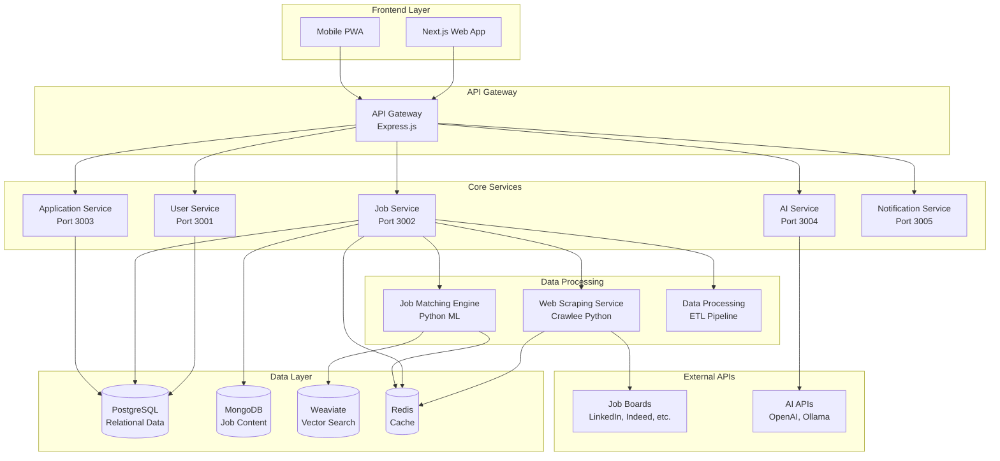
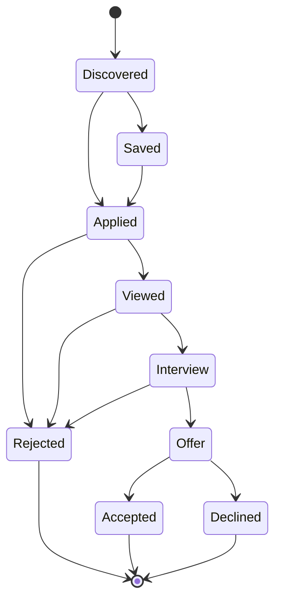
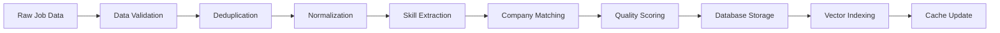

# SparkApply Sprint 3: Job Management System Architecture

**Author**: Manus AI  
**Date**: October 2, 2025  
**Sprint**: Sprint 3 - Job Management System  
**Status**: 🔄 **IN PROGRESS**

## Executive Summary

Sprint 3 focuses on building a comprehensive job management system that serves as the core engine for SparkApply's job discovery and matching capabilities. This system will integrate web scraping using Crawlee Python, intelligent job matching algorithms, and comprehensive application tracking to create a seamless job search experience.

## 🎯 Sprint 3 Objectives

### **Phase 1: System Architecture Analysis**
- Analyze job management requirements and data flow
- Design scalable microservice architecture
- Define database schemas and relationships
- Plan integration with existing user management system

### **Phase 2: Job Posting System**
- Implement CRUD operations for job postings
- Create employer dashboard and job management features
- Build job search and filtering capabilities
- Establish job categorization and tagging system

### **Phase 3: Web Scraping Infrastructure**
- **Primary**: Crawlee Python for robust, scalable scraping
- **Fallbacks**: BeautifulSoup, Scrapy, Selenium for specific use cases
- Multi-source job aggregation from major job boards
- Data normalization and deduplication pipelines

### **Phase 4: Job Matching Engine**
- AI-powered job-candidate compatibility scoring
- Skills-based matching algorithms
- Location and preference filtering
- Real-time recommendation engine

### **Phase 5: Application Tracking System**
- Complete application lifecycle management
- Status tracking and notifications
- Analytics and reporting dashboard
- Integration with user profiles and employer systems

## 🏗️ System Architecture

### **Microservices Design**



### **Data Flow Architecture**

| **Component** | **Technology** | **Purpose** | **Port** |
|---------------|----------------|-------------|----------|
| **Job Service** | Node.js/Express | Job CRUD, search, management | 3002 |
| **Web Scraper** | Crawlee Python | Multi-source job aggregation | 3006 |
| **Matching Engine** | Python/ML | AI-powered job matching | 3007 |
| **Application Service** | Node.js/Express | Application lifecycle tracking | 3003 |
| **Data Processor** | Python/Pandas | ETL, normalization, deduplication | 3008 |

## 🗄️ Database Schema Design

### **PostgreSQL - Relational Data**

#### **Jobs Table**
```sql
CREATE TABLE jobs (
    id SERIAL PRIMARY KEY,
    external_id VARCHAR(255) UNIQUE,
    title VARCHAR(500) NOT NULL,
    company_name VARCHAR(255) NOT NULL,
    company_id INTEGER REFERENCES companies(id),
    location VARCHAR(255),
    remote_type VARCHAR(50), -- remote, hybrid, on_site
    employment_type VARCHAR(50), -- full_time, part_time, contract, internship
    experience_level VARCHAR(50), -- entry, mid, senior, executive
    salary_min INTEGER,
    salary_max INTEGER,
    salary_currency VARCHAR(3) DEFAULT 'USD',
    description TEXT,
    requirements TEXT,
    benefits TEXT,
    skills JSONB DEFAULT '[]',
    categories JSONB DEFAULT '[]',
    source VARCHAR(100), -- linkedin, indeed, company_website
    source_url VARCHAR(1000),
    posted_date TIMESTAMP,
    expires_date TIMESTAMP,
    is_active BOOLEAN DEFAULT true,
    is_featured BOOLEAN DEFAULT false,
    view_count INTEGER DEFAULT 0,
    application_count INTEGER DEFAULT 0,
    quality_score DECIMAL(3,2), -- 0.00 to 1.00
    created_at TIMESTAMP DEFAULT CURRENT_TIMESTAMP,
    updated_at TIMESTAMP DEFAULT CURRENT_TIMESTAMP
);
```

#### **Companies Table**
```sql
CREATE TABLE companies (
    id SERIAL PRIMARY KEY,
    name VARCHAR(255) NOT NULL,
    slug VARCHAR(255) UNIQUE,
    description TEXT,
    website_url VARCHAR(500),
    logo_url VARCHAR(500),
    industry VARCHAR(100),
    company_size VARCHAR(50), -- startup, small, medium, large, enterprise
    location VARCHAR(255),
    founded_year INTEGER,
    is_verified BOOLEAN DEFAULT false,
    rating DECIMAL(2,1), -- 1.0 to 5.0
    review_count INTEGER DEFAULT 0,
    created_at TIMESTAMP DEFAULT CURRENT_TIMESTAMP,
    updated_at TIMESTAMP DEFAULT CURRENT_TIMESTAMP
);
```

#### **Applications Table**
```sql
CREATE TABLE applications (
    id SERIAL PRIMARY KEY,
    user_id INTEGER NOT NULL REFERENCES users(id),
    job_id INTEGER NOT NULL REFERENCES jobs(id),
    status VARCHAR(50) DEFAULT 'applied', -- applied, viewed, interview, offer, rejected, withdrawn
    applied_date TIMESTAMP DEFAULT CURRENT_TIMESTAMP,
    last_updated TIMESTAMP DEFAULT CURRENT_TIMESTAMP,
    cover_letter TEXT,
    resume_url VARCHAR(500),
    custom_fields JSONB DEFAULT '{}',
    employer_notes TEXT,
    interview_date TIMESTAMP,
    offer_details JSONB,
    rejection_reason VARCHAR(255),
    created_at TIMESTAMP DEFAULT CURRENT_TIMESTAMP,
    updated_at TIMESTAMP DEFAULT CURRENT_TIMESTAMP,
    UNIQUE(user_id, job_id)
);
```

#### **Job Matches Table**
```sql
CREATE TABLE job_matches (
    id SERIAL PRIMARY KEY,
    user_id INTEGER NOT NULL REFERENCES users(id),
    job_id INTEGER NOT NULL REFERENCES jobs(id),
    compatibility_score DECIMAL(3,2) NOT NULL, -- 0.00 to 1.00
    match_factors JSONB DEFAULT '{}', -- skills, location, salary, etc.
    user_action VARCHAR(50), -- liked, disliked, applied, saved, ignored
    action_date TIMESTAMP,
    created_at TIMESTAMP DEFAULT CURRENT_TIMESTAMP,
    UNIQUE(user_id, job_id)
);
```

### **MongoDB - Job Content & Analytics**

#### **Job Content Collection**
```javascript
{
  _id: ObjectId,
  job_id: Number, // Reference to PostgreSQL
  raw_content: {
    original_html: String,
    parsed_text: String,
    structured_data: Object
  },
  extracted_data: {
    skills: [String],
    qualifications: [String],
    responsibilities: [String],
    benefits: [String],
    company_culture: String
  },
  scraping_metadata: {
    source: String,
    scraped_at: Date,
    scraper_version: String,
    quality_indicators: Object
  },
  processing_history: [{
    processed_at: Date,
    processor: String,
    changes: Object
  }],
  created_at: Date,
  updated_at: Date
}
```

#### **Scraping Jobs Collection**
```javascript
{
  _id: ObjectId,
  job_id: String,
  source: String,
  url: String,
  status: String, // pending, processing, completed, failed
  priority: Number,
  scheduled_at: Date,
  started_at: Date,
  completed_at: Date,
  retry_count: Number,
  error_message: String,
  metadata: Object,
  created_at: Date
}
```

### **Weaviate - Vector Search**

#### **Job Embeddings Schema**
```python
job_schema = {
    "class": "Job",
    "properties": [
        {"name": "job_id", "dataType": ["int"]},
        {"name": "title", "dataType": ["text"]},
        {"name": "description", "dataType": ["text"]},
        {"name": "skills", "dataType": ["text[]"]},
        {"name": "company", "dataType": ["text"]},
        {"name": "location", "dataType": ["text"]},
        {"name": "salary_range", "dataType": ["text"]},
        {"name": "embedding_version", "dataType": ["text"]}
    ],
    "vectorizer": "text2vec-openai"
}
```

## 🕷️ Web Scraping Architecture

### **Primary Scraper: Crawlee Python**

#### **Advantages of Crawlee Python**
- **Robust Error Handling**: Built-in retry mechanisms and error recovery
- **Anti-Detection**: Automatic browser fingerprinting and proxy rotation
- **Scalability**: Distributed crawling with queue management
- **Data Quality**: Built-in data validation and normalization
- **Monitoring**: Comprehensive logging and metrics collection

#### **Scraper Implementation Structure**
```python
# crawlee_job_scraper.py
from crawlee import PlaywrightCrawler, Router
from crawlee.storages import Dataset

class JobScraper:
    def __init__(self):
        self.crawler = PlaywrightCrawler(
            max_requests_per_crawl=1000,
            headless=True,
            browser_type='chromium'
        )
        self.router = Router()
        self.setup_routes()
    
    def setup_routes(self):
        @self.router.default_handler
        async def job_list_handler(context):
            # Extract job listing URLs
            pass
        
        @self.router.handler('job_detail')
        async def job_detail_handler(context):
            # Extract detailed job information
            pass
    
    async def scrape_job_board(self, board_config):
        # Main scraping logic
        pass
```

### **Fallback Scrapers**

#### **BeautifulSoup - Static Content**
```python
# For simple, static job boards
import requests
from bs4 import BeautifulSoup

class BeautifulSoupScraper:
    def scrape_static_jobs(self, url):
        response = requests.get(url)
        soup = BeautifulSoup(response.content, 'html.parser')
        return self.extract_job_data(soup)
```

#### **Scrapy - High-Volume Scraping**
```python
# For large-scale, structured scraping
import scrapy

class JobSpider(scrapy.Spider):
    name = 'jobs'
    
    def parse(self, response):
        # Extract and yield job data
        pass
```

#### **Selenium - Complex JavaScript Sites**
```python
# For sites requiring complex interactions
from selenium import webdriver

class SeleniumScraper:
    def __init__(self):
        self.driver = webdriver.Chrome()
    
    def scrape_dynamic_jobs(self, url):
        # Handle JavaScript-heavy sites
        pass
```

### **Target Job Boards**

| **Job Board** | **Priority** | **Scraper** | **Frequency** | **Volume** |
|---------------|--------------|-------------|---------------|------------|
| **LinkedIn** | High | Crawlee Python | Daily | 10,000+ |
| **Indeed** | High | Crawlee Python | Daily | 15,000+ |
| **Glassdoor** | Medium | Crawlee Python | Daily | 5,000+ |
| **AngelList** | Medium | BeautifulSoup | Daily | 2,000+ |
| **Stack Overflow** | Medium | Scrapy | Daily | 1,500+ |
| **Company Websites** | Low | Selenium | Weekly | 5,000+ |

## 🤖 Job Matching Engine

### **Matching Algorithm Components**

#### **1. Skills Matching**
```python
def calculate_skills_match(user_skills, job_skills):
    """
    Calculate compatibility based on skill overlap and proficiency
    """
    skill_weights = {
        'exact_match': 1.0,
        'related_skill': 0.7,
        'transferable_skill': 0.4
    }
    # Implementation details...
```

#### **2. Experience Level Matching**
```python
def calculate_experience_match(user_experience, job_requirements):
    """
    Match user experience with job requirements
    """
    experience_mapping = {
        'entry': (0, 2),
        'mid': (2, 5),
        'senior': (5, 10),
        'executive': (10, float('inf'))
    }
    # Implementation details...
```

#### **3. Location & Remote Preferences**
```python
def calculate_location_match(user_preferences, job_location):
    """
    Calculate location compatibility including remote options
    """
    # Implementation details...
```

#### **4. Salary Expectations**
```python
def calculate_salary_match(user_expectations, job_offer):
    """
    Match salary expectations with job offers
    """
    # Implementation details...
```

### **Machine Learning Models**

#### **Job Recommendation Model**
- **Algorithm**: Collaborative Filtering + Content-Based
- **Features**: User behavior, job interactions, profile data
- **Training Data**: User swipes, applications, job views
- **Update Frequency**: Daily batch processing

#### **Skill Extraction Model**
- **Algorithm**: NLP with Named Entity Recognition
- **Purpose**: Extract skills from job descriptions
- **Training Data**: Labeled job postings
- **Accuracy Target**: >90%

## 📱 Application Tracking System

### **Application Lifecycle**



### **Status Tracking Features**
- **Real-time Updates**: WebSocket connections for live status changes
- **Email Notifications**: Automated updates on status changes
- **Analytics Dashboard**: Application success rates and trends
- **Employer Integration**: API endpoints for employer status updates

## 🔄 Data Processing Pipeline

### **ETL Workflow**



### **Data Quality Measures**
- **Validation Rules**: Required fields, format checking, data types
- **Deduplication**: Fuzzy matching on title, company, location
- **Quality Scoring**: Completeness, accuracy, freshness metrics
- **Monitoring**: Data quality dashboards and alerts

## 🚀 Performance & Scalability

### **Scalability Targets**
- **Job Processing**: 100,000+ jobs per day
- **User Requests**: 10,000+ concurrent users
- **Search Response**: <200ms average
- **Matching Engine**: <500ms per recommendation set

### **Caching Strategy**
- **Redis Layers**: Search results, user preferences, job recommendations
- **CDN**: Static assets, company logos, cached API responses
- **Database**: Query optimization, proper indexing, connection pooling

### **Monitoring & Observability**
- **Metrics**: Application performance, scraping success rates, matching accuracy
- **Logging**: Structured logging with correlation IDs
- **Alerting**: Real-time alerts for system failures and performance degradation

## 🔒 Security & Compliance

### **Data Protection**
- **PII Handling**: Secure storage and processing of personal information
- **GDPR Compliance**: Data retention policies and user rights
- **Rate Limiting**: Prevent abuse of scraping and API endpoints
- **Authentication**: Secure API access with JWT tokens

### **Scraping Ethics**
- **Robots.txt Compliance**: Respect website scraping policies
- **Rate Limiting**: Reasonable request frequencies to avoid overloading
- **User Agent**: Proper identification in scraping requests
- **Legal Compliance**: Adherence to terms of service and copyright laws

## 📈 Success Metrics

### **Technical Metrics**
- **Scraping Success Rate**: >95%
- **Data Quality Score**: >90%
- **API Response Time**: <200ms
- **System Uptime**: >99.9%

### **Business Metrics**
- **Job Match Accuracy**: >80%
- **User Engagement**: Daily active users, session duration
- **Application Conversion**: Swipe-to-application rate
- **Employer Satisfaction**: Job posting success rates

## 🔮 Future Enhancements

### **Phase 2 Additions**
- **Real-time Job Alerts**: Push notifications for matching jobs
- **Advanced Filtering**: AI-powered search with natural language
- **Company Insights**: Employee reviews, culture analysis
- **Salary Intelligence**: Market rate analysis and negotiation tips

### **Integration Opportunities**
- **ATS Integration**: Direct integration with Applicant Tracking Systems
- **Calendar Integration**: Interview scheduling automation
- **Social Media**: LinkedIn profile integration and networking
- **Learning Platforms**: Skill development recommendations

---

This architecture document serves as the foundation for Sprint 3 development, ensuring a scalable, efficient, and user-focused job management system that will power SparkApply's core job discovery and matching capabilities.
