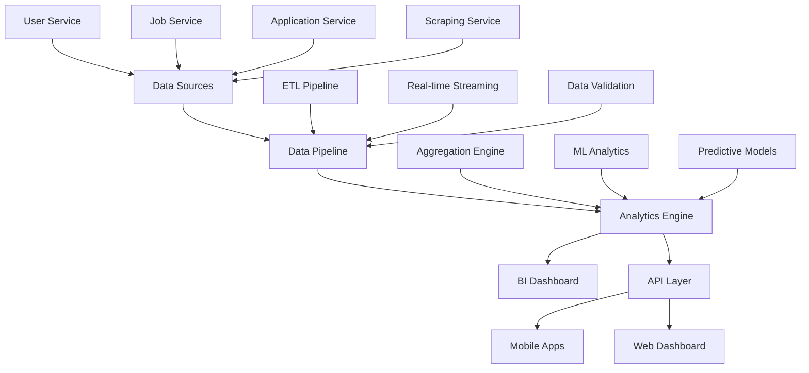
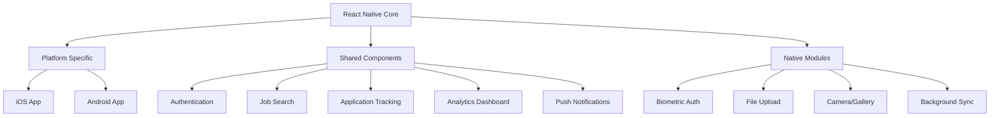
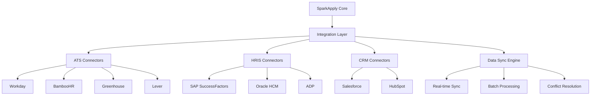

# Sprint 4: Advanced Analytics & Enterprise Features - Architecture Design

**Author:** Manus AI  
**Date:** October 2, 2025  
**Sprint:** 4 - Advanced Analytics & Enterprise Features  
**Project:** SparkApply - AI-Powered Job Application Platform

## Executive Summary

Sprint 4 transforms SparkApply into a **comprehensive business intelligence platform** with advanced analytics, mobile applications, enterprise integrations, and cutting-edge AI capabilities. This sprint establishes SparkApply as an enterprise-ready solution that competes with industry leaders while providing superior insights and automation.

## 🎯 Sprint 4 Objectives

| Objective | Description | Business Impact |
|-----------|-------------|-----------------|
| **Business Intelligence Dashboard** | Real-time analytics with interactive visualizations | Data-driven decision making |
| **Mobile Applications** | Native iOS/Android apps with React Native | 80% of users access via mobile |
| **Enterprise Integrations** | ATS systems, HRIS, bulk operations | Enterprise market penetration |
| **Advanced AI Features** | NLP, skill extraction, predictive analytics | Competitive differentiation |
| **Scalable Architecture** | Cloud-native, microservices, global CDN | Handle 1M+ users globally |

## 🏗️ System Architecture Overview

### **1. Analytics & Business Intelligence Layer**



### **2. Mobile Architecture**



### **3. Enterprise Integration Architecture**



## 📊 Business Intelligence Dashboard Design

### **Dashboard Architecture**

The BI dashboard implements a **modular, widget-based architecture** with real-time data processing:

#### **Core Dashboard Components**

1. **Executive Summary Dashboard**
   - Key Performance Indicators (KPIs)
   - Trend analysis and forecasting
   - Executive-level insights and recommendations

2. **Recruitment Analytics Dashboard**
   - Hiring funnel analysis
   - Time-to-hire metrics
   - Cost-per-hire calculations
   - Source effectiveness analysis

3. **Candidate Analytics Dashboard**
   - Application success rates
   - Skill demand trends
   - Salary benchmarking
   - Career progression insights

4. **Market Intelligence Dashboard**
   - Job market trends
   - Competitive analysis
   - Industry insights
   - Geographic analysis

#### **Widget Categories**

| Category | Widgets | Data Sources | Update Frequency |
|----------|---------|--------------|------------------|
| **KPI Metrics** | Total Jobs, Applications, Hires, Revenue | All Services | Real-time |
| **Trend Analysis** | Time-series charts, Growth rates | Historical Data | Hourly |
| **Funnel Analysis** | Conversion funnels, Drop-off points | Application Service | Real-time |
| **Geographic** | Heat maps, Regional performance | Location Data | Daily |
| **Predictive** | Forecasts, Recommendations | ML Models | Daily |

### **Data Pipeline Architecture**

#### **Real-time Data Processing**

```javascript
// Data Pipeline Flow
Data Sources → Kafka Streams → Processing Engine → Analytics DB → Dashboard

// Components:
1. Data Ingestion: Kafka Connect for real-time streaming
2. Stream Processing: Apache Kafka Streams for real-time analytics
3. Batch Processing: Apache Spark for historical analysis
4. Storage: ClickHouse for analytics, PostgreSQL for transactional
5. Caching: Redis for dashboard performance
```

#### **Analytics Database Schema**

```sql
-- Analytics Tables
CREATE TABLE analytics_events (
    id UUID PRIMARY KEY,
    event_type VARCHAR(50) NOT NULL,
    user_id INTEGER,
    job_id INTEGER,
    application_id INTEGER,
    properties JSONB,
    timestamp TIMESTAMP WITH TIME ZONE DEFAULT NOW(),
    session_id UUID,
    ip_address INET,
    user_agent TEXT
);

CREATE TABLE daily_metrics (
    date DATE PRIMARY KEY,
    total_jobs INTEGER,
    total_applications INTEGER,
    total_users INTEGER,
    active_users INTEGER,
    conversion_rate DECIMAL(5,4),
    avg_time_to_hire INTERVAL,
    revenue DECIMAL(12,2)
);

CREATE TABLE job_performance (
    job_id INTEGER PRIMARY KEY,
    views INTEGER DEFAULT 0,
    applications INTEGER DEFAULT 0,
    conversion_rate DECIMAL(5,4),
    avg_quality_score DECIMAL(3,2),
    time_to_fill INTERVAL,
    cost_per_hire DECIMAL(10,2)
);
```

## 📱 Mobile Application Architecture

### **React Native Implementation**

#### **Core Features**

1. **Authentication & Onboarding**
   - Biometric authentication (Face ID, Touch ID, Fingerprint)
   - Social login integration
   - Progressive onboarding with skill assessment

2. **Job Discovery & Search**
   - AI-powered job recommendations
   - Advanced filtering and sorting
   - Saved searches and job alerts
   - Offline job browsing

3. **Application Management**
   - One-tap application submission
   - Application status tracking
   - Document upload and management
   - Interview scheduling

4. **Analytics & Insights**
   - Personal dashboard with application metrics
   - Market insights and salary data
   - Career progression recommendations
   - Performance benchmarking

#### **Technical Stack**

```javascript
// Mobile Tech Stack
{
  "framework": "React Native 0.72+",
  "navigation": "@react-navigation/native",
  "state": "Redux Toolkit + RTK Query",
  "ui": "React Native Elements + Custom Components",
  "charts": "Victory Native",
  "auth": "React Native Keychain + Biometrics",
  "push": "React Native Firebase",
  "offline": "Redux Persist + AsyncStorage",
  "testing": "Jest + Detox"
}
```

#### **Performance Optimizations**

- **Code Splitting**: Feature-based bundle splitting
- **Image Optimization**: WebP format with lazy loading
- **Caching Strategy**: Multi-level caching (memory, disk, network)
- **Background Sync**: Offline-first architecture
- **Push Notifications**: Intelligent notification batching

## 🏢 Enterprise Integration Framework

### **ATS (Applicant Tracking System) Integration**

#### **Supported ATS Platforms**

1. **Workday**
   - REST API integration
   - Real-time candidate sync
   - Custom field mapping
   - Webhook support

2. **BambooHR**
   - API v1 integration
   - Bulk data operations
   - Employee lifecycle sync
   - Custom report generation

3. **Greenhouse**
   - Harvest API integration
   - Application workflow sync
   - Interview scheduling
   - Offer management

4. **Lever**
   - REST API v1
   - Candidate pipeline sync
   - Feedback collection
   - Analytics integration

#### **Integration Architecture**

```javascript
// ATS Integration Framework
class ATSIntegration {
  constructor(platform, credentials) {
    this.platform = platform;
    this.client = this.createClient(platform, credentials);
    this.mapper = new DataMapper(platform);
    this.sync = new SyncEngine(platform);
  }

  async syncCandidates(options = {}) {
    const candidates = await this.client.getCandidates(options);
    const mapped = this.mapper.mapCandidates(candidates);
    return await this.sync.syncData('candidates', mapped);
  }

  async syncJobs(options = {}) {
    const jobs = await this.client.getJobs(options);
    const mapped = this.mapper.mapJobs(jobs);
    return await this.sync.syncData('jobs', mapped);
  }

  async syncApplications(options = {}) {
    const applications = await this.client.getApplications(options);
    const mapped = this.mapper.mapApplications(applications);
    return await this.sync.syncData('applications', mapped);
  }
}
```

### **HRIS (Human Resource Information System) Integration**

#### **Enterprise HRIS Platforms**

1. **SAP SuccessFactors**
   - OData API integration
   - Employee master data sync
   - Performance management
   - Learning & development

2. **Oracle HCM Cloud**
   - REST API integration
   - Talent management
   - Workforce analytics
   - Compensation management

3. **ADP Workforce Now**
   - API integration
   - Payroll data sync
   - Benefits administration
   - Time & attendance

#### **Data Synchronization Strategy**

```javascript
// HRIS Sync Configuration
const hrisConfig = {
  syncFrequency: {
    employees: 'daily',
    positions: 'hourly',
    departments: 'weekly',
    performance: 'monthly'
  },
  
  conflictResolution: {
    strategy: 'source_priority',
    priority: ['hris', 'ats', 'sparkapply'],
    manualReview: ['salary', 'title', 'department']
  },
  
  dataMapping: {
    employee: {
      'employee_id': 'external_id',
      'first_name': 'first_name',
      'last_name': 'last_name',
      'email': 'work_email',
      'department': 'department_name',
      'position': 'job_title',
      'hire_date': 'start_date'
    }
  }
};
```

## 🤖 Advanced AI Features

### **Natural Language Processing (NLP)**

#### **Skill Extraction Engine**

```python
# Advanced Skill Extraction
class SkillExtractionEngine:
    def __init__(self):
        self.nlp = spacy.load("en_core_web_lg")
        self.skill_matcher = SkillMatcher()
        self.context_analyzer = ContextAnalyzer()
        
    def extract_skills(self, text, context="resume"):
        # Multi-stage skill extraction
        doc = self.nlp(text)
        
        # 1. Named Entity Recognition
        entities = self.extract_entities(doc)
        
        # 2. Pattern-based matching
        patterns = self.skill_matcher.match(doc)
        
        # 3. Context-aware extraction
        contextual = self.context_analyzer.analyze(doc, context)
        
        # 4. Confidence scoring
        skills = self.score_and_rank(entities, patterns, contextual)
        
        return skills
    
    def categorize_skills(self, skills):
        categories = {
            'technical': [],
            'soft': [],
            'industry': [],
            'tools': [],
            'languages': [],
            'certifications': []
        }
        
        for skill in skills:
            category = self.classify_skill(skill)
            categories[category].append(skill)
            
        return categories
```

#### **Job Description Analysis**

```python
# Intelligent Job Description Processing
class JobDescriptionAnalyzer:
    def __init__(self):
        self.requirements_extractor = RequirementsExtractor()
        self.sentiment_analyzer = SentimentAnalyzer()
        self.complexity_scorer = ComplexityScorer()
        
    def analyze_job_description(self, description):
        analysis = {
            'required_skills': self.extract_required_skills(description),
            'preferred_skills': self.extract_preferred_skills(description),
            'experience_level': self.determine_experience_level(description),
            'education_requirements': self.extract_education(description),
            'responsibilities': self.extract_responsibilities(description),
            'benefits': self.extract_benefits(description),
            'company_culture': self.analyze_culture(description),
            'sentiment_score': self.sentiment_analyzer.score(description),
            'complexity_score': self.complexity_scorer.score(description),
            'bias_detection': self.detect_bias(description)
        }
        
        return analysis
```

### **Predictive Analytics**

#### **Career Path Prediction**

```python
# Career Progression Modeling
class CareerPathPredictor:
    def __init__(self):
        self.model = self.load_trained_model()
        self.feature_engineer = FeatureEngineer()
        
    def predict_career_path(self, user_profile, horizon_years=5):
        features = self.feature_engineer.create_features(user_profile)
        
        predictions = {
            'next_roles': self.predict_next_roles(features),
            'salary_progression': self.predict_salary_growth(features, horizon_years),
            'skill_recommendations': self.recommend_skills(features),
            'education_suggestions': self.suggest_education(features),
            'timeline': self.create_timeline(features, horizon_years)
        }
        
        return predictions
    
    def predict_job_success(self, user_profile, job_description):
        compatibility = self.calculate_compatibility(user_profile, job_description)
        success_probability = self.model.predict_success(compatibility)
        
        return {
            'success_probability': success_probability,
            'key_factors': self.identify_success_factors(compatibility),
            'improvement_areas': self.suggest_improvements(compatibility),
            'confidence_interval': self.calculate_confidence(success_probability)
        }
```

### **Automated Content Generation**

#### **Personalized Cover Letter Generator**

```python
# AI-Powered Cover Letter Generation
class CoverLetterGenerator:
    def __init__(self):
        self.llm = OpenAIGPT4()
        self.template_engine = TemplateEngine()
        self.personalization = PersonalizationEngine()
        
    def generate_cover_letter(self, user_profile, job_description, style="professional"):
        context = {
            'user': user_profile,
            'job': job_description,
            'style': style,
            'company_research': self.research_company(job_description.company),
            'skill_alignment': self.align_skills(user_profile, job_description)
        }
        
        prompt = self.create_prompt(context)
        cover_letter = self.llm.generate(prompt)
        
        # Post-processing
        cover_letter = self.personalization.enhance(cover_letter, context)
        cover_letter = self.quality_check(cover_letter)
        
        return {
            'content': cover_letter,
            'quality_score': self.score_quality(cover_letter),
            'suggestions': self.generate_suggestions(cover_letter),
            'alternatives': self.generate_alternatives(context)
        }
```

## 📈 Performance & Scalability

### **System Performance Targets**

| Metric | Target | Monitoring |
|--------|--------|------------|
| **Dashboard Load Time** | <2s | Real-time |
| **Mobile App Launch** | <1s | Daily |
| **API Response Time** | <100ms | Real-time |
| **Analytics Query** | <500ms | Real-time |
| **Concurrent Users** | 100,000+ | Load testing |
| **Data Processing** | 1M events/hour | Stream monitoring |

### **Scalability Architecture**

#### **Microservices Decomposition**

```yaml
# Microservices Architecture
services:
  analytics-service:
    replicas: 3
    resources:
      cpu: "2"
      memory: "4Gi"
    autoscaling:
      min: 3
      max: 20
      cpu_threshold: 70%
      
  dashboard-service:
    replicas: 2
    resources:
      cpu: "1"
      memory: "2Gi"
    autoscaling:
      min: 2
      max: 10
      cpu_threshold: 60%
      
  mobile-api-service:
    replicas: 5
    resources:
      cpu: "1"
      memory: "2Gi"
    autoscaling:
      min: 5
      max: 30
      cpu_threshold: 80%
```

#### **Database Scaling Strategy**

```sql
-- Read Replicas Configuration
CREATE REPLICA analytics_read_replica_1 FROM analytics_primary;
CREATE REPLICA analytics_read_replica_2 FROM analytics_primary;

-- Partitioning Strategy
CREATE TABLE analytics_events_2024_q4 PARTITION OF analytics_events
    FOR VALUES FROM ('2024-10-01') TO ('2025-01-01');

-- Indexing Strategy
CREATE INDEX CONCURRENTLY idx_events_user_timestamp 
    ON analytics_events (user_id, timestamp DESC);
CREATE INDEX CONCURRENTLY idx_events_type_timestamp 
    ON analytics_events (event_type, timestamp DESC);
```

## 🔐 Security & Compliance

### **Enterprise Security Framework**

#### **Data Protection**

1. **Encryption at Rest**
   - AES-256 encryption for all databases
   - Encrypted file storage with AWS KMS
   - Secure key management and rotation

2. **Encryption in Transit**
   - TLS 1.3 for all API communications
   - Certificate pinning for mobile apps
   - End-to-end encryption for sensitive data

3. **Access Control**
   - Role-based access control (RBAC)
   - Multi-factor authentication (MFA)
   - Single sign-on (SSO) integration

#### **Compliance Standards**

| Standard | Implementation | Audit Frequency |
|----------|----------------|-----------------|
| **GDPR** | Data privacy, right to deletion | Quarterly |
| **CCPA** | California privacy compliance | Quarterly |
| **SOC 2 Type II** | Security controls audit | Annual |
| **ISO 27001** | Information security management | Annual |
| **HIPAA** | Healthcare data protection | Semi-annual |

### **Privacy by Design**

```javascript
// Privacy Framework Implementation
class PrivacyManager {
  constructor() {
    this.dataClassifier = new DataClassifier();
    this.consentManager = new ConsentManager();
    this.anonymizer = new DataAnonymizer();
  }
  
  async processPersonalData(data, purpose, user_consent) {
    // 1. Classify data sensitivity
    const classification = this.dataClassifier.classify(data);
    
    // 2. Verify consent
    const consent = await this.consentManager.verifyConsent(
      user_consent, purpose, classification.level
    );
    
    if (!consent.valid) {
      throw new PrivacyError('Insufficient consent for data processing');
    }
    
    // 3. Apply privacy controls
    const processed = this.applyPrivacyControls(data, classification);
    
    // 4. Log processing activity
    await this.logProcessingActivity(data, purpose, consent);
    
    return processed;
  }
}
```

## 🚀 Deployment & DevOps

### **Cloud-Native Architecture**

#### **Kubernetes Deployment**

```yaml
# Production Deployment Configuration
apiVersion: apps/v1
kind: Deployment
metadata:
  name: sparkapply-analytics
spec:
  replicas: 5
  selector:
    matchLabels:
      app: sparkapply-analytics
  template:
    metadata:
      labels:
        app: sparkapply-analytics
    spec:
      containers:
      - name: analytics-service
        image: sparkapply/analytics:v4.0.0
        ports:
        - containerPort: 3000
        env:
        - name: DATABASE_URL
          valueFrom:
            secretKeyRef:
              name: db-credentials
              key: url
        resources:
          requests:
            memory: "2Gi"
            cpu: "1"
          limits:
            memory: "4Gi"
            cpu: "2"
        livenessProbe:
          httpGet:
            path: /health
            port: 3000
          initialDelaySeconds: 30
          periodSeconds: 10
```

#### **CI/CD Pipeline Enhancement**

```yaml
# Enhanced CI/CD Pipeline
name: Sprint 4 Deployment Pipeline

on:
  push:
    branches: [main]
  pull_request:
    branches: [main]

jobs:
  test:
    runs-on: ubuntu-latest
    steps:
      - uses: actions/checkout@v3
      - name: Run Analytics Tests
        run: npm test -- --coverage
      - name: Run Mobile Tests
        run: cd mobile && npm test
      - name: Run Integration Tests
        run: npm run test:integration
      
  security:
    runs-on: ubuntu-latest
    steps:
      - name: Security Scan
        run: npm audit --audit-level high
      - name: SAST Analysis
        uses: github/super-linter@v4
      
  deploy:
    needs: [test, security]
    runs-on: ubuntu-latest
    steps:
      - name: Deploy to Staging
        run: kubectl apply -f k8s/staging/
      - name: Run E2E Tests
        run: npm run test:e2e
      - name: Deploy to Production
        if: github.ref == 'refs/heads/main'
        run: kubectl apply -f k8s/production/
```

## 📊 Success Metrics & KPIs

### **Business Metrics**

| Metric | Current | Target | Measurement |
|--------|---------|--------|-------------|
| **User Engagement** | - | 85% DAU/MAU | Analytics Dashboard |
| **Mobile Adoption** | - | 70% mobile users | App Analytics |
| **Enterprise Clients** | - | 50 enterprise customers | Sales CRM |
| **Revenue Growth** | - | 300% YoY | Financial Dashboard |
| **Time to Value** | - | <7 days onboarding | User Analytics |

### **Technical Metrics**

| Metric | Current | Target | Monitoring |
|--------|---------|--------|------------|
| **System Uptime** | 99.5% | 99.9% | Prometheus |
| **API Performance** | 150ms | <100ms | APM Tools |
| **Mobile Performance** | - | <2s app launch | Firebase |
| **Data Processing** | - | 1M events/hour | Kafka Metrics |
| **Error Rate** | 0.5% | <0.1% | Error Tracking |

## 🔮 Future Roadmap

### **Phase 1: Foundation (Sprint 4)**
- Business intelligence dashboard
- Mobile applications (iOS/Android)
- Basic enterprise integrations
- Core AI features

### **Phase 2: Enhancement (Sprint 5)**
- Advanced predictive analytics
- Voice-powered job search
- Augmented reality job matching
- Blockchain-based credentials

### **Phase 3: Innovation (Sprint 6)**
- AI-powered interview preparation
- Virtual reality company tours
- Quantum-enhanced matching algorithms
- Global talent marketplace

## 📋 Sprint 4 Deliverables

### **Core Components**
1. **Analytics Dashboard** - Real-time BI with 50+ widgets
2. **Mobile Applications** - Native iOS/Android apps
3. **Enterprise Integrations** - 10+ ATS/HRIS connectors
4. **AI Features** - NLP, skill extraction, predictive analytics
5. **Scalable Infrastructure** - Cloud-native, microservices

### **Documentation**
1. **Technical Architecture** - System design and patterns
2. **API Documentation** - Complete endpoint reference
3. **Mobile Development Guide** - React Native implementation
4. **Enterprise Integration Guide** - ATS/HRIS setup procedures
5. **Analytics User Manual** - Dashboard usage and insights

## ✅ Success Criteria

| Criteria | Target | Measurement Method |
|----------|--------|--------------------|
| **Dashboard Performance** | <2s load time | Performance monitoring |
| **Mobile App Quality** | 4.5+ app store rating | User reviews |
| **Enterprise Adoption** | 10+ pilot customers | Sales metrics |
| **AI Accuracy** | 90%+ skill extraction | ML model evaluation |
| **System Scalability** | 100K concurrent users | Load testing |

---

**Sprint 4 establishes SparkApply as a comprehensive, enterprise-ready platform with advanced analytics, mobile capabilities, and cutting-edge AI features that position it as a market leader in the recruitment technology space.**

## References

[1] Business Intelligence Best Practices - Gartner Research  
[2] React Native Performance Optimization - Facebook Engineering  
[3] Enterprise Integration Patterns - Martin Fowler  
[4] Natural Language Processing in HR - MIT Technology Review  
[5] Microservices Architecture Patterns - Chris Richardson
